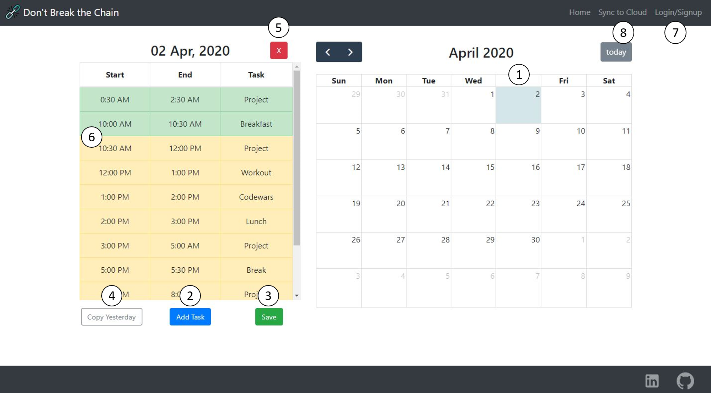
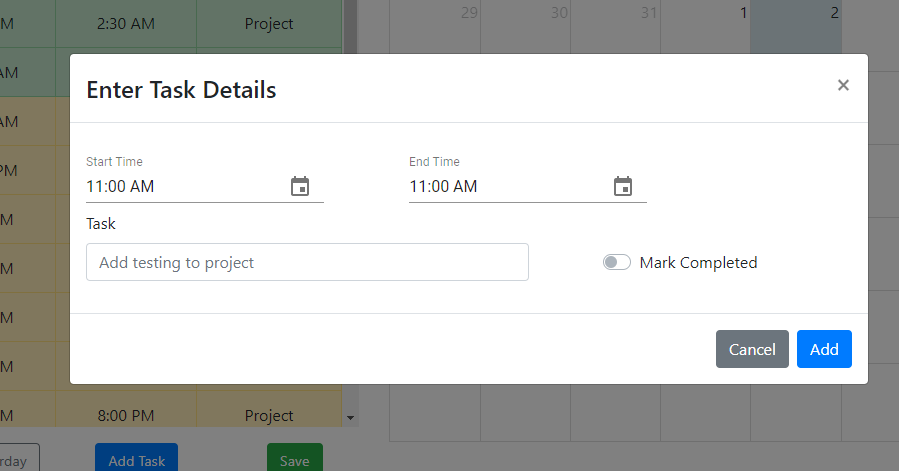
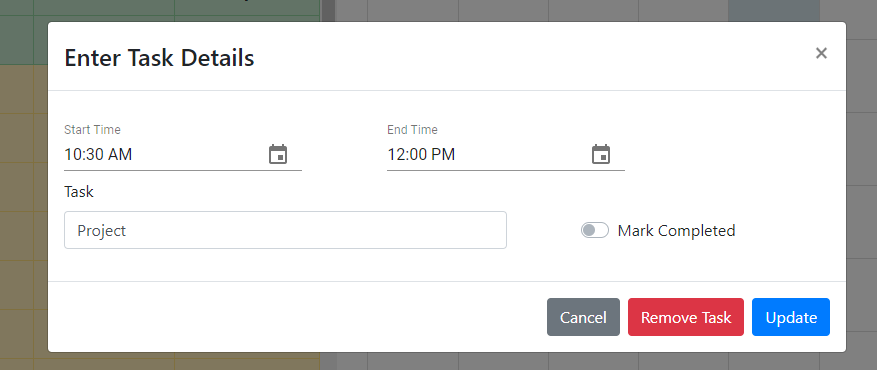
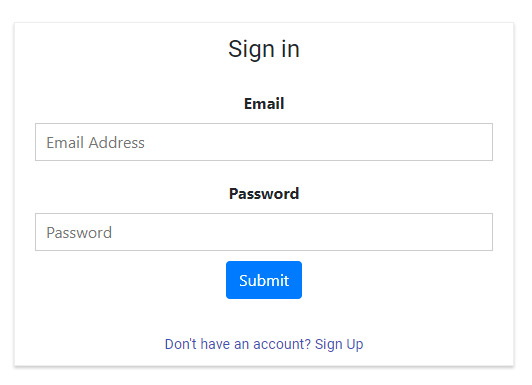

# [Don't Break The Chain](https://dbtc-74557.web.app/)
## Productivity App

Jerry Seinfeld's Productivity Secret [Read full here](https://lifehacker.com/jerry-seinfelds-productivity-secret-281626)

## TL;DR
Jerry Seinfeld essentially says to write good jokes one needs to write a lot of jokes. To consistently accomplish that take calendar and mark everyday you have been successful. This will make a chain over long period of time. You'll have motivation to continue to stay productive and "Not Breaking The Chain".

## 1. App Description
  - App allows you to feed in the tasks you wish to accomplish in a day.
  - If you complete 80% tasks for the day you get "Green" (success) recorded in calendar.
  - If you fail (complete lesser than 80% of tasks) you get "Red" recorded in calender.
  - Stay Productive - Keep the green chain alive - Don't Break The Cahin.
  
## 2. Tools/Software Used
  - Javascript/ReactJS
  - CSS - Flexbox, Grid
  - Material UI, Bootstrap 4, FullCalendar (Javascript)
  - Redux, React Hooks, Axios, Routers
  - Backend: Firebase/Google Cloud Plateform
  
## 3. Features of Application
  - Home Screen:
  
  - 1. Select a Day in calendar.
  - 2. Add Task
    
  - 3. Save Task: Saves all the app data on browser LocalStorage, allowing you to work offline and comeback later.
  - 4. If most of your tasks remain simialr each day, use "Copy yesterday" to avoid to mannually feed details each day.
  - 5. Button to Remove all the tasks for the day.
  - 6. Click on any task to update/Remove/Mark Complete: Remember you need to complete 80% tasks to win the day!
    
  - 7. Login/Signup
    
  - 8. Sync to Cloud: Make your progress permanent and accessible from anywhere!
  
  
  
  
